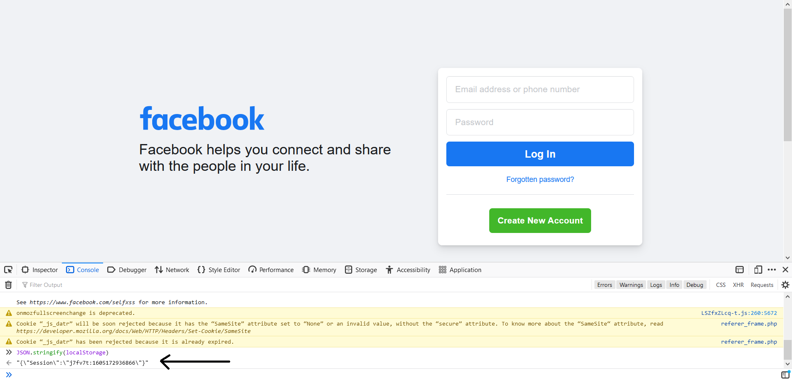

# Cookie-based Authentication with Flask for Single Page Applications

This article will see how to set up cookie-based authentication for Single-Page Applications(SPAs). We are going to use Flask as our backend with Flask-Login for handling sessions. The frontend is handled using svelte, a framework that compiles code into js and CSS during the build stage.

## Cookie v/s Token-based authentication
### What are they?

Cookie-based authentication has been around since the beginning of authentication. This method stores a cookie recording the user session in the user's browser. The cookie-based authentication works as follows.

- User login into the application.
- The server creates a session id, logs it, and sends it back to the browser.
- The browser stores the session ID in cookies.
- The browser sends the cookie whenever the website is loaded.
- The server checks for the user associated with the cookie and sends back the data.
Once the user logs out, the server destroys the cookie's record on both the client and server-side.

As you can see, cookie-based authentication is stateful, which means the server tracks which user the session-id belongs to.

Token-based authentication is relatively new compared to cookie-based. They gained traction due to the rise of Single Page Applications(SPAs) and APIs. The most common token is JSON Web Tokens(JWT). The token-based authentication method is stateless. This means the server does not store tokens but instead checks whether the request is coming from an authorized source. See the token workflow below,

- The user logs into the application.
- The server validates the credentials and sends back a signed token.
- In most cases, the token is stored in the localStorage.
- Every request to the server carries the token in its headers.
- The server decodes the token and checks for its validity.
- Once the user logs out, the token is destroyed on the client-side; no server interaction is required.

### CSRF (cookies) vs XSS (localstorage)

Earlier, we discussed how cookies/sessions are stored in cookies, and tokens are stored in localStorage. Let's see the difference between them.

#### Cookie
- Small in size, ~4KB
- Can be read by both client-side and server-side
- Expiry can be set

Cookies associated with a domain are sent along with all the requests to that particular domain. For example, if you visit https://facebook.com, all the cookies associated with Facebook are sent along with the request. This makes it vulnerable to Cross-Site Request Forgery, where an attacker can include a malicious code to perform state changes on a particular server. Once you click the link or load the page, the code performs state changes on your account because, as said earlier, all the cookies are sent along with the request. So the server thinks of the request coming from the user. CSRF can be used to perform state-changing operations like transferring money or liking a post etc. CSRF cannot send data back to the attacker or anybody else. Read more about CSRF, and it's prevention in Flask [here](https://testdriven.io/blog/csrf-flask/).

#### localStorage
- Up to 10MB
- Can be read by client-side javascript
- Supports no expiry, can only be cleared using javascript

Tokens are stored in localStorage, which is only accessible to javascript, making it susceptible to Cross-Site Scripting(XSS). XSS means injecting javascript code into the client-side, usually to bypass the same-origin policy. Unlike CSRF, XSS can send back responses to a server. 

Open a web browser and navigate to https://facebook.com(or any website of your choice). Now press `F12` to open the developer tools and choose the `console` tab. Now type `JSON.stringify(localStorage)` and press enter, this should print the localStorage elements in a JSON serialized form. 



It is that easy for a script to access the localStorage. An attacker could have a simple script to read all the data and send back or an image tag that looks like,

```html

```

This appends the data to the link and requests the attacker. The attacker can send a random image to make it look like nothing happened. We know that tokens are stateless; the server does not keep track of tokens; instead, it appends a token role. For example, the token issued to me is authorized to access my data. The attacker who has my token can send it along with requests and get all my data and privileges on the website.


## Setting up cookie-based auth

Now we will see how to setup cookie-based authentication for a Flask-SPA using Flask-Login. We are going to build two applications,

1. Flask + Svelte SPA (different domains) (Secure, HttpOnly cookies)
1. Flask + Svelte served up via Flask/Jinja Templates

### Flask + Svelte SPA (different domains)

Here we set up the Flask app and svelte app on different ports.  

Let's start by creating a project directory,

```bash
mkdir flask-spa-cross-origin && cd flask-spa-cross-origin
```

Now create a folder each for frontend and backend.

```bash
# this is where we define our backend
mkdir server 

# app folder is where our frontend resides. 
# We'll use a template to create the app
npx degit sveltejs/template app
```

The directory should look like,

```bash
Project:
├───app
|   ├───node_modules
│   ├───public
│   │   └───build
│   ├───scripts
│   └───src
└───server
    ├───app.py
    └───requirements.txt
```

#### Setup the backend

```bash
cd server
```

The backend code for both examples is the same. Flask-Login handles the login, and it is defined as,

```python
class User(UserMixin):
    ...


def get_user(user_id: int):
    for user in users:
        if int(user["id"]) == int(user_id):
            return user
    return None


@login_manager.user_loader
def user_loader(id: int):
    user = get_user(id)
    if user:
        user_model = User()
        user_model.id = user["id"]
        return user_model
    return None

```

The backend has routes to take care of the following.

- Check whether a session exists
- User login
- User logout
- Fetch user data

Let's see how each of them is defined.

1. Check for the existence of a session

    ```python
    @app.route("/api/getsession")
    def check_session():
        if current_user.is_authenticated:
            return jsonify({"login": True})
        return jsonify({"login": False})
    ```

    This returns true if the session exists, else false.


2. Handle user login

    ```python
    @app.route("/api/login", methods=["POST"])
    def login():
        data = request.json
        username = data.get("username")
        password = data.get("password")

        for user in users:
            if user["username"] == username and user["password"] == password:
                user_model = User()
                user_model.id = user["id"]
                login_user(user_model)
                return jsonify({"login": True})
        return jsonify({"login": False})
    ```

    `/api/login` accepts username and password as a JSON post request. The code checks against the database for user credentials. If it exists, the functions return true, else false.


3. Handle user logout

    ```python
    @app.route("/api/logout")
    @login_required
    def logout():
        logout_user()
        return jsonify({"logout": True})
    ```
  
    The logout code destroys the user session.

4. Fetch user data

    ```python
    @app.route("/api/data", methods=["GET"])
    @login_required
    def user_data():
        user = get_user(current_user.id)

        return jsonify({"name": user["username"]})
    ```

    `/api/data` returns the username of the active session.


The server runs on port `5000`. Run the server by running `python app.py`.

#### Set up the frontend

The front-end design for both examples is similar, so only the difference will be highlighted for the next example. Start by installing the dependencies.

```bash
# make sure you cd into the directory
cd app

npm i
```

Now install `page`, which handles routing for the frontend.

```bash
npm i page
```

We have two pages, one for login and the other for user data. Let's start by defining the login page.

```html
<div class="container">
        <form>
            username:
            <input type="text" bind:value={username} />
            password:
            <input type="password" bind:value={password} />
            <button type="button" on:click={login}>login</button>
        </form>
        <p>
            {#if error}{error}{/if}
        </p>
    </div>
```

The login page consists of two inputs, one for username and another for the password. When submitted, the `login` function gets executed. 

```javascript
const login = () => {
        fetch("http://localhost:5000/api/login", {
            method: "POST",
            headers: {
                "Content-Type": "application/json",
            },
            credentials: "include",
            body: JSON.stringify({ username: username, password: password }),
        })
            .then((res) => res.json())
            .then((data) => {
                if (data.login == true) {
                    router.redirect("/user");
                } else {
                    error = "Bad credentials";
                }
            })
            .catch((err) => {
                error = "Error connecting to server";
            });
    };
```

The `login` function is straightforward. We collect the username and password and send it to the `/api/login` on the server explained earlier. The function validates the request and sends back true if the login exists. Once the login function receives true, the page redirects to the `/user` page, else throws an error. One thing to notice above is the `credentials: 'include'`. This is required to make the cookies available to the server.

We defined the login page. But what about the existing session? Shouldn't it login automatically? Yes, for that we need to define a function that checks for existing session on page load. We define `session.js` in the same directory as,

```javascript
export function getSession(condition, location) {
    fetch("http://localhost:5000/api/getsession", {
        credentials: "include",
    })
        .then((res) => res.json())
        .then((data) => {
            console.log(data);
            if (data.login == condition) {
                router.redirect(location);
            }
        })
        .catch((err) => {
            console.log(err);
        });
}

```

The function checks for an existing session. It takes in two parameters, one the condition returned by the session and the other the route to redirect to. For example, `getSession(true, "/user")` in our case would make the page redirect to /user if the session exists. 

We need to check for user sessions on page load. Then `onMount` in svelte makes this possible. The following code will be added to the script on our login page above any other function call.

```javascript
import { onMount } from "svelte";
import { getSession } from "./session";

onMount(() => {
        getSession(true, "/user");
    });
```


Now, let's define the user page, which displays the user data. This page also checks for the existing session on page load.

```javascript
onMount(() => {
        getSession(false, "/");
    });
```

In this case, if the session does not exist, we redirect to the home page.

The user page fetched the username for the active session and displayed it on screen. 

```html
    <div class="container">
        <h3>Profile</h3>
        <button type="button" on:click={logout}>logout</button>
        <hr />
        <p>Name: {name}</p>
        <p>
            {#if error}{error}{/if}
        </p>
    </div>
```

The page calls logout when the logout button is clicked. 

```javascript
const logout = () => {
        fetch("http://localhost:5000/api/logout", {
            credentials: "include",
        })
            .then(() => router.redirect("/"))
            .catch((err) => {
                error = "Error connecting to server";
            });
    };
```

The `name` variable is set to be fetched automatically when the page loads, update the onMount function to,


```javascript
onMount(() => {
        getSession(false, "/");

        fetch("http://localhost:5000/api/data", {
            credentials: "include",
        })
            .then((res) => res.json())
            .then((data) => (name = data.name))
            .catch((err) => (error = err));
    });
```

That's it; the frontend is built successfully. However, there are a couple of important things to take care of. 

1. The `start` command under `scripts` in `package.json` must be modified to build the single page application with routing

    ```json
    // the app will run on port 8080

    "start": "sirv public --single --port 8080"
    ```

2. The frontend runs on port 8080, whereas the backend runs on port 5000. There is a need to set up CORS for resource sharing; otherwise, the connection would fail. Use `Flask-Cors` to setup CORS for our server. Update the app.py to,

    ```python
    from flask_cors import CORS


    app = Flask(__name__)
    app.config.update(
        DEBUG=True,
        SECRET_KEY="secret_sauce",
    )

    cors = CORS(
    app,
    supports_credentials=True,
    resources={r"/api/*": {"origins": "http://localhost:8080"}},
    )
    ```

    Now only `http://localhost:8080` can access the resources at `/api/*`. You can now start the server using `python app.py` in the server directory and frontend using `npm run start` in the app directory.

#### Watch the app in action


### Flask + Svelte SPA (served via templates)

Here we build the frontend and serve the index.html using Flask. 

Start by creating the project,


```bash
# create a project from template
npx degit sveltejs/template flask-spa-jinja

# cd into the directory
cd flask-spa-jinja

# install dependencies
npm i

# install page for routing
npm i page

# create app.py for flask
touch app.py
```

Move the `index.html` file in the public folder to a new folder in the project's root named `templates`. The project directory should look like,

```bash
Project:
├───node_modules
├───public
│   └───build
├───scripts
├───src
├───templates
└───app.py
```

The code for this example remains the same, apart from the following,

- Since we are deploying from same-origin, no need to set up CORS
- Update flask `app` by specifying the `static` directory

    ```python
    app = Flask(__name__, static_folder="public")
    ```

- Once it is done, replace all URLs in `templates/index.html` to jinj2 types. Your `index.html` should look like,

    ```html
    <!DOCTYPE html>
    <html lang="en">
    <head>
        <meta charset='utf-8'>
        <meta name='viewport' content='width=device-width,initial-scale=1'>

        <title>Svelte app</title>

        <link rel='icon' type='image/png' href="{{url_for('static', filename='favicon.png')}}">
        <link rel='stylesheet' href="{{url_for('static', filename='global.css') }}">
        <link rel='stylesheet' href="{{url_for('static', filename='build/bundle.css') }}">

        <script defer src="{{url_for('static', filename='build/bundle.js') }}"></script>
    </head>

    <body>
    </body>
    </html>

    ```

- Setup the Flask app to render index.html at `/` route. Since the application has a page at `/user` and it is served via Flask app, the Flask will intercept the path when the user manually types `http://localhost:5000/user` and throws an error. To circumvent this, we must tell Flask to render `index.html` as such instances.

    ```python
    @app.route("/", defaults={"path": ""})
    @app.route("/<path:path>")
    def home(path):
        return render_template("index.html")
    ```

    This will render `index.html` even when the user manually types `http://localhost:5000/user`.

- All fetch API calls in `src/*.svelte` can be `/api/login` instead of `http://localhost:5000/api/login` (remove the most part as we are serving same-origin).

- `credentials: 'include'` becomes `credentials: 'same-origin'`.

That' it, we are good to go. When ready, build the application(frontend) by running,

```bash
npm run build
```

After the build finishes(it is rapid), start the application by running,

```python 
python app.py
```

Navigate to `localhost:5000` and see the app running. 